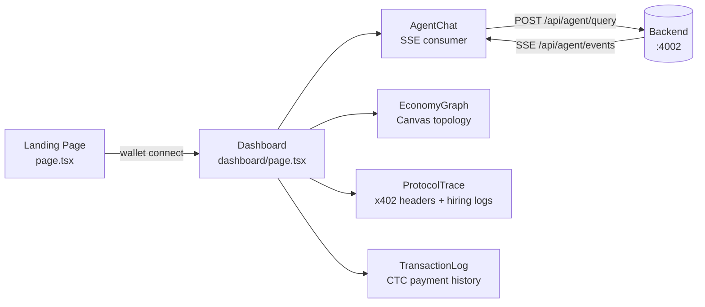

# Kortana — Frontend

Next.js 16 + React 19 dashboard for the Kortana AI marketing agent platform.

## Pages

| Route | Description |
|-------|-------------|
| `/` | Landing page — wallet connect entry point |
| `/dashboard` | Main app — agent chat, economy graph, transaction log |
| `/agents` | Agent roster with status and pricing |
| `/tools` | Tool catalog from live `/api/tools` registry |

## Key Components



## Dev

```bash
cd frontend
npm run dev     # Next.js dev server on port 3000
npm run build   # Production build
npm run lint    # ESLint
```

## Environment

```bash
NEXT_PUBLIC_API_URL=http://localhost:4002          # Backend URL
NEXT_PUBLIC_SERVER_ADDRESS=0x...                   # STT receiving address (display only)
```

Defaults to `https://kortana.onrender.com` if `NEXT_PUBLIC_API_URL` is not set.
